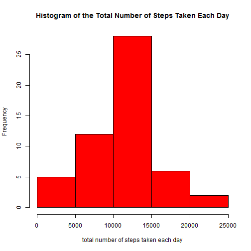
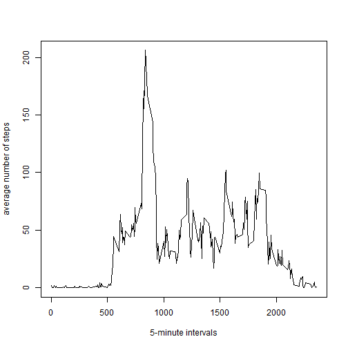

# Reproducible Research: Peer Assessment 1


## Loading and preprocessing the data

1.Load the data

```r
data <- read.csv("activity.csv")
```


2.Process/transform the data

```r
data <- transform(data, date = as.Date(date, "%Y-%m-%d"))
```


## What is mean total number of steps taken per day?


1.Make a histogram of the total number of steps taken each day

```r
total <- tapply(data$steps, data$date, sum)
hist(total, col = "Red", xlab = "total number of steps taken each day", main = "Histogram of the Total Number of Steps Taken Each Day")
```

 


2.Calculate and report the mean and median total number of steps taken per day

```r
mean(total, na.rm = TRUE)
```

```
## [1] 10766
```

```r
median(total, na.rm = TRUE)
```

```
## [1] 10765
```


## What is the average daily activity pattern?

1.Make a time series plot (i.e. type = "l") of the 5-minute interval (x-axis) and the average number of steps taken, averaged across all days (y-axis)

```r
means <- tapply(data$steps, data$interval, function(x) {
    mean(x, na.rm = TRUE)
})
intervals <- as.numeric(names(means))
plot(intervals, means, type = "l", xlab = "5-minute intervals", ylab = "average number of steps")
```

 


2.Which 5-minute interval, on average across all the days in the dataset, contains the maximum number of steps?

```r
names(which.max(means))
```

```
## [1] "835"
```


## Imputing missing values


## Are there differences in activity patterns between weekdays and weekends?
